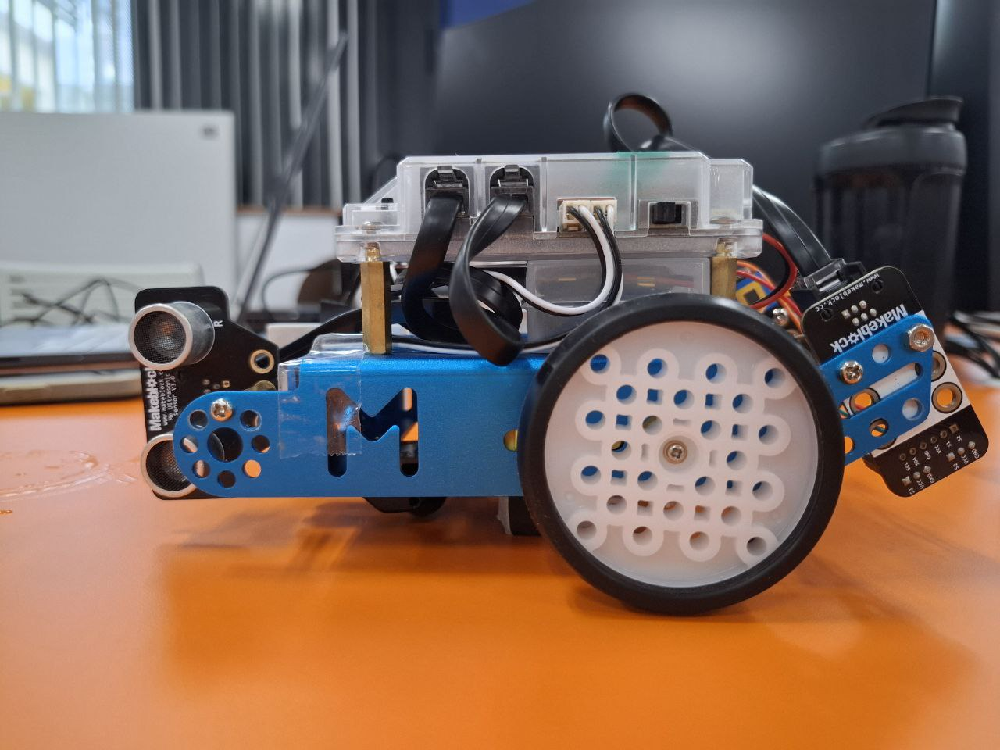
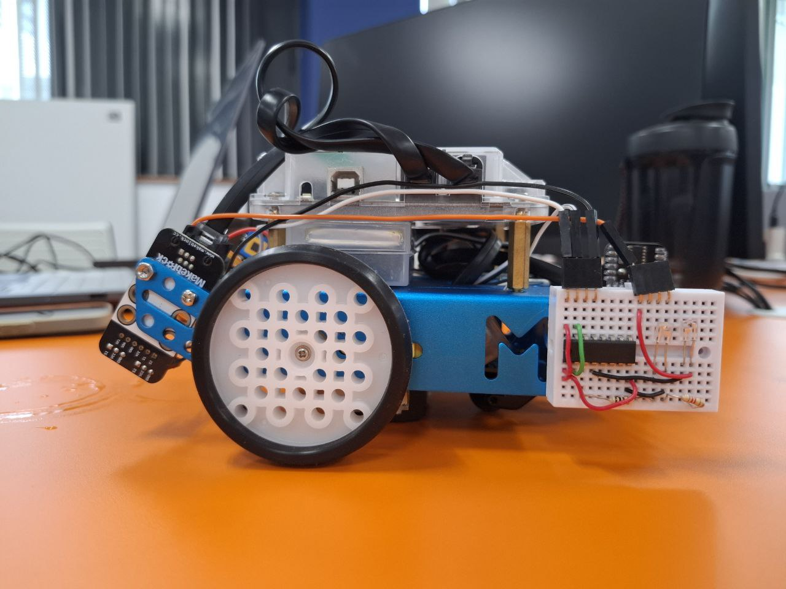

# The A-maze-ing Race Project
Our task is to build an mBot robot capable of navigating a maze in the shortest time possible. Along the route, the robot will encounter colored tiles that indicate the next direction it should take to successfully move through the maze. The maze is bordered by walls that the robot must detect and avoid while progressing toward the goal.

Pictures of our mBot project:
|  |  |
|:-:|:-:|
| Left side (Infrared sensor) | Right side (Ultrasonic sensor) |

## Maze Details
Our robot is designed to navigate a maze similar to the one depicted below. It must avoid colliding with any walls, marked by blue lines along the sides.

*A sample maze layout*

During its journey through the maze, the robot will encounter waypoint challenges marked by black strips on the maze floor. Each waypoint challenge consists of a colored tile on the floor, with five possible colors: red, orange, green, blue, and purple. Each color instructs the robot to execute a specific turn to continue navigating the maze correctly.

At the end of the maze, the tile beneath the mBot at the final waypoint will be white, signaling the maze's completion.

*Colour interpretation for waypoint challenges*

*Five types of turns that our mBot needs to execute*

## Setting up the mBot
The following are the hardware connections to the mBot for our program to run correctly. 

<table>
<tr>
  <th style="text-align:center"> Motor connections </th>
  <th style="text-align:center"> mBot sensor connections </th>
</tr>
<tr><td>

| Motor Port | Side |
|:----------:|:----:|
| **M1** | Left motor  |
| **M2** | Right motor |

</td><td>

| mBot port | Sensor |
|:---------:|:------:|
| **Port 1** |  Ultrasonic sensor   |
| **Port 2** | Line Follower sensor |

</td></tr> </table>

Calibrate the color sensor first and then run the main program, `project.ino`. Ensure that all other files `a_utility.ino`, `b_navigation.ino`, `c_peripherals.ino`, `d_sensor.ino`, and `e_test_func.ino` are set as tabs within the main ino file so that they compile together seamlessly. Verify that these files are correctly recognized as tabs to avoid any compilation errors.

## Implementation
The full explanation of our robot implementation can be viewed in our group report [here]().

## No walls? No problem!
The moving straight algorithm enables the robot to navigate the maze even in the absence of walls. It accomplishes this by making real-time adjustments to the robot’s movements based on input from the ultrasonic sensor, which detects pillars within the maze. These sensor readings allow the robot to apply corrective actions and stay on course.

https://github.com/user-attachments/assets/55cba2b2-758b-4710-8f37-f6089df17916

